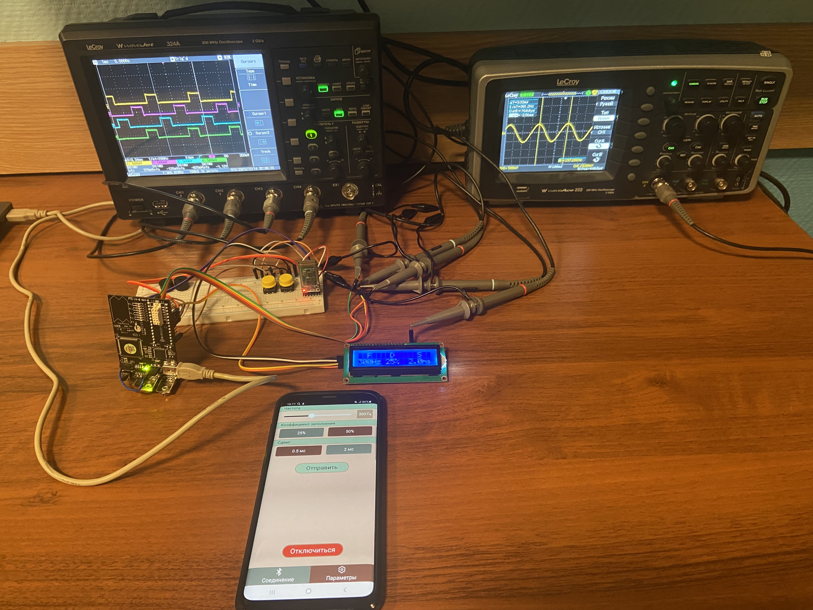

# Signal Generator based on PSoC 5

## Overview

The Signal Generator is a versatile device designed to generate PWM and sine signals with controllable parameters. The project consists of two main components: the hardware, based on the PSoC 5 microcontroller, and the remote control application developed using C++ and Qt5.15 for Linux and Android platforms.

## Features

- **PWM and Sinusoidal Signal Generation**: Generate precise PWM and sinusoidal signals with customizable parameters.
- **Local Control**: Manage the generator via onboard buttons and menu.
- **Remote Control**: Use a mobile application developed with C++/Qt5.15 to control the generator from Linux or Android devices.
- **Bluetooth Connectivity**: Utilizes the HC-05 Bluetooth module for wireless communication.
- **Python Algorithm for Signal Calculation**: A Python script was developed to calculate voltage values for generating sinusoidal signals.
- **C Programming for Microcontroller**: The PSoC 5 microcontroller is programmed using C to handle signal generation and control logic.

## Technologies Used

### Hardware

- **PSoC 5 Microcontroller**: The core component for signal generation.
- **HC-05 Bluetooth Module**: Enables wireless communication between the generator and the mobile application.
- **Buttons and Menu Interface**: For direct interaction with the generator.
- **LCD Display**: To show current settings and signal parameters.

### Software

- **C**: Used for programming the PSoC 5 microcontroller to manage signal generation and device control.
- **C++/Qt5.15**: For developing the cross-platform mobile application that runs on Linux and Android.
- **Python**: To create an algorithm for calculating the voltage values necessary for generating sinusoidal signals.
- **Arduino (C)**: Used for setting up the HC-05 Bluetooth module.

## Functionality

- **Signal Generation**: The device can generate both PWM and sine signals. The parameters of these signals can be adjusted either directly on the device or via the mobile application.
- **User Interface**: The onboard buttons and menu interface allow users to navigate through settings and make adjustments.
- **Remote Control**: The mobile application provides a user-friendly interface for remote operation, displaying current signal parameters and allowing adjustments in real time.

## Detailed Components and Configuration

### Bluetooth Module Setup

The HC-05 Bluetooth module is configured using an Arduino to ensure it operates correctly with the PSoC 5 microcontroller. The setup involves setting the appropriate baud rate and pairing settings to establish a reliable connection with the mobile application.

### Signal Calculation

A custom Python algorithm calculates the voltage values needed to create smooth sinusoidal signals. These values are stored in the PSoC 5's memory and used by the DAC to generate the analog output.

### Microcontroller Programming

The PSoC 5 microcontroller is programmed in C to manage the core functionalities of the signal generator, including signal generation, user input handling, and Bluetooth communication. The C code ensures efficient and reliable operation of the hardware components and implements the logic for parameter adjustments and signal output.
